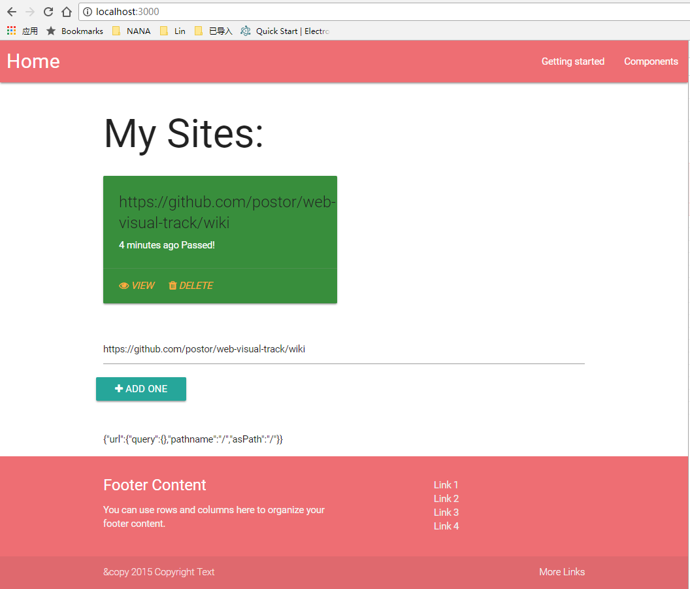

# web-visual-track

```
git clone https://github.com/postor/simple-visual-test.git
cd simple-visual-test
yarn && yarn dev

#or production 
yarn && yarn build && yarn start
```

then open http://localhost:3000 to use


